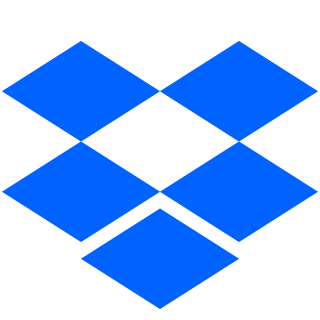
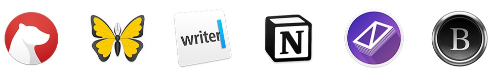

#  Dropdraft - Dropbox as a blogging platform

Use Netlify + Dropbox as a blogging platform. Every time you add or update a markdown file in Dropbox, Netlify automatically pulls the data from your Dropbox and builds a new version of your site. For the syncing I used [Netlibox](https://github.com/jimniels/netlibox) by Jim Nielsen. The included example uses a simple handlebars template to render the markdown files, but you can edit scripts/build.js to work with your preferred static site generator or template engine.

Works with any app that supports Markdown, like:

## Background

I love writing markdown blog posts in apps like Ulysses, Byword and Bear, but if you want to be able to post to your blog without leaving the app, you're mostly limited to using proprietary platforms like Wordpress.com, Medium or Blogger (often without support for updating posts).

I wanted a system that is:
1. supported by most writing apps on mobile and desktop
2. allows syncing posts to Github/Netlify/Vercel to use it with any SSG or SPA
3. is not tied to a proprietary blogging platform. 

In comes Dropbox, which is supported by most apps, can be synced in realtime and although it proprietary as well, it does not tie you to a certain content format.

## How to set it up

### 1. Fork this repo and create site in Netlify
Fork this repo and create [a new site in Netlify](https://app.netlify.com/start) tied to your forked repo. Don't worry about the Netlify settings, they will be set automatically through netlify.toml

### 2. Create a new app in Dropbox
[Setup an app](https://www.dropbox.com/developers/apps) in your Dropbox account. Under 'access type' choose 'app folder'. This folder will be stored inside the 'Apps' folder in your Dropbox and contain your blogposts.

### 3. Generate a Dropbox access token
Find your app in the [Developer App Console](https://www.dropbox.com/developers/apps) then under 'Oauth2' click the 'Generate' access token button. Copy the access token for the next step.

### 4. Copy the access token to Netlify
On the Netlify site, go to Your site > Settings > Build & deploy > Build environment variables and create a new access token called `DBX_ACCESS_TOKEN` and fill in the Dropbox access token from the previous step

### 5. Create a Netlify build hook URL
On the Netlify site, go to Settings > Build & deploy > Build Hooks > Add build hook and generate a new build hook URL. Copy the URL, and scroll up to create a new environment variable called `NETLIFY_BUILD_HOOK_URL` and paste the URL there.

### 6. Paste the webhook URL in the Dropbox app console
Back in Dropbox app console create a new webhook and paste the URL from the previous step.

If you got stuck somewhere, here's Jim's original cheat sheet:

Once you've done all this, you should be able to create a markdown file in Dropbox and see it get deployed to your Netlify site's URL.

## List of apps that are compatible with DropDraft
Below is a (far from comprehensive) list of apps that are compatible with Dropbox and Dropdraft. Of course there are many, many more apps that can sync or save to Dropbox and as such compatible with Dropdraft.

### Apps with built-in Dropbox integration
In some apps you can use your Dropbox folder as a source. This way you can manage all your posts without leaving the app:
- :butterfly: Ulysses (Mac/iOS)
- :notebook: Byword (Mac/iOS)
- :one: 1Writer (iOS)
- :package: Dropbox itself (Mac/Windows/iOS)

### Apps that export to Dropbox
The apps below have no native Dropbox integration, but allow you to export single posts to Dropbox:
- :bear: Bear (Mac/iOS)
- :blue_book: Notion (Mac/Windows/iOS)
- :page_with_curl: Lightpaper (Mac)
- :fountain_pen: iA Writer (Mac/Windows/iOS/Android)

## Acknowledgements
Thanks to Jim Nielsen for creating Netlibox, on which the syncing part is based. Read Jim Nielsen's [original post about Netlibox (Jekyll-based)](https://www.netlify.com/blog/2018/10/15/combining-netlify-with-dropbox-for-a-one-click-publishing-process/) for some more background on how the syncing works.

